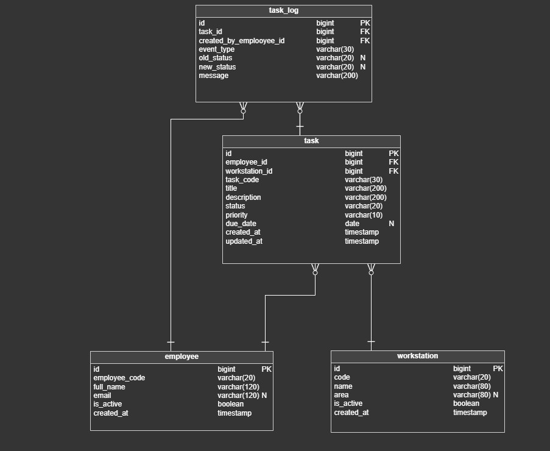

# Task Manager

A Spring Boot application for managing Employees, Tasks, Task Logs and Workstations.  
The project demonstrates a classic **Controller → Service → Repository** architecture with DTO-based API, validation, error handling and unit tests.

---

## Table of Contents

1. [Description](#1-description)
2. [Tech Stack](#2-tech-stack)
3. [Prerequisites](#3-prerequisites)
4. [Getting Started](#4-getting-started)
5. [Database Initialization](#5-database-initialization)
6. [Application Architecture](#6-application-architecture)
7. [Error Handling](#7-error-handling)
8. [Testing](#8-testing)

## 1. Description

This application implements basic CRUD operations for a simple task management system.

Main domain objects:

- **Employee** – company employees
- **Workstation** – workplaces where tasks are executed
- **Task** – work items assigned to employees and workstations
- **TaskLog** – history of task-related events 

The main goals of the project are:

- demonstrate clean backend architecture
- separate API layer from persistence
- use DTOs instead of exposing entities
- handle errors in a centralized way
- cover business logic with unit tests

## 2. Tech Stack

- Java 21
- Spring Boot
- Spring Data JPA
- HSQLDB 
- MapStruct 
- Lombok
- JUnit 5
- Mockito
- Gradle

## 3. Prerequisites

To run the project you need:

- Java JDK 21 installed
- Gradle 
- IntelliJ IDEA is recommended but not required

## 4. Getting Started

### Clone the repository

## git clone <repository-url>
## cd task-manager

--Run the application:
--Using Gradle:
## ./gradlew bootRun

--Or from IntelliJ IDEA:
--Open the project
-Run MyprojectApplication

-The application will start on:
## http://localhost:8080
-Swagger UI:
## http://localhost:8080/swagger-ui/index.html

## 5. Database Initialization

-The project uses HSQLDB as an in-memory database.
-Database initialization is handled automatically on startup using:

-schema.sql – creates database tables
-data.sql – inserts initial test data

## Database Model (ER Diagram)

The ER diagram was designed in Vertabelo.

-Both files are located in:

-src/main/resources/
-The database is reset every time the application restarts.

## 6. Application Architecture

The project follows a layered architecture:

## Controller layer

--Handles HTTP requests
--Performs input validation using @Valid
--Works only with DTOs
--Does not contain business logic

## Service layer

--Contains all business logic
--Validates domain rules
--Resolves entity relations
--Throws domain-specific exceptions

## Repository layer

--Uses Spring Data JPA
--Works only with entities
--No business logic inside repositories

## DTO and Mapping

All API communication is done via DTOs
MapStruct is used for entity ↔ DTO mapping
Patch updates ignore null values
Relations are resolved explicitly in services

## 7. Error Handling

--Centralized error handling is implemented using @ControllerAdvice.
--Handled cases include:

## 404 Not Found – entity does not exist

## 400 Bad Request – validation or business rule violations

## 403 Forbidden – forbidden operations

--Error responses are returned in a unified JSON format using ApiError.
--To avoid duplicated error messages across services, the project uses a centralized ErrorCode enum with message templates.

## 8. Testing

Unit tests are implemented for the Service layer.

## Covered scenarios:
-entity not found cases
-successful create operations
-partial updates 
-relation resolution (Employee / Workstation)
-delete operations

## Testing tools:

 --JUnit 5,Mockito  

-Repositories and mappers are mocked to focus tests on business logic only.
Run tests:
 ## ./gradlew test